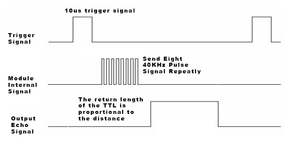
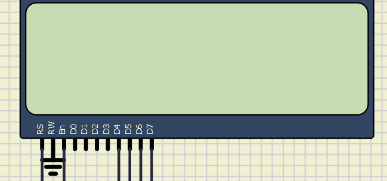
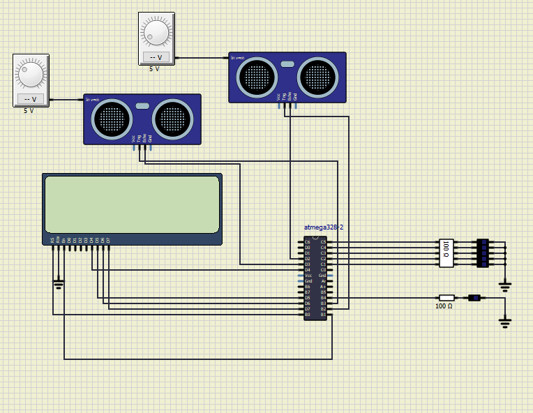
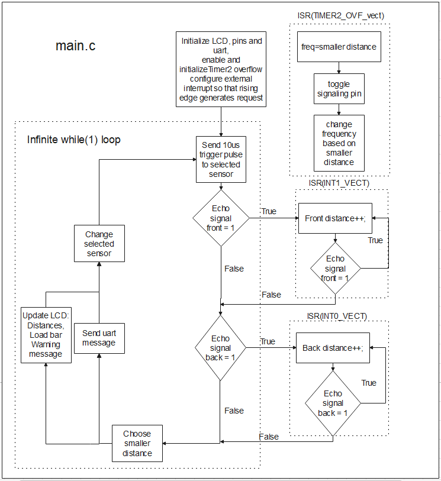
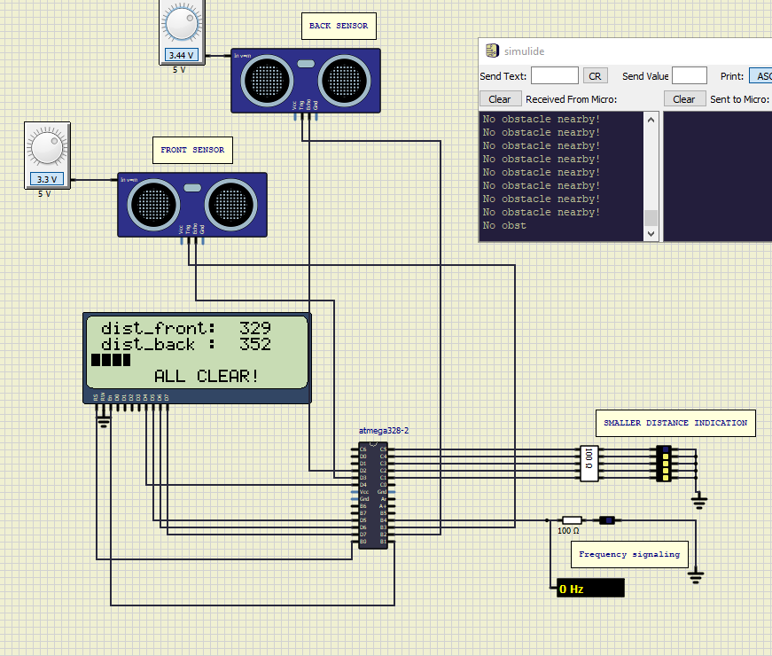
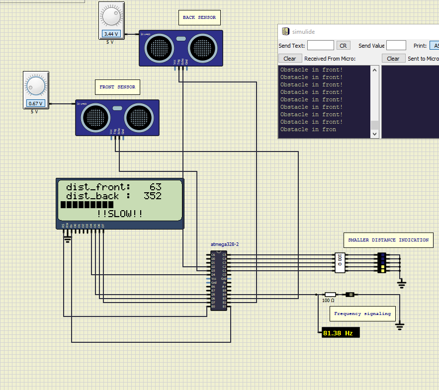
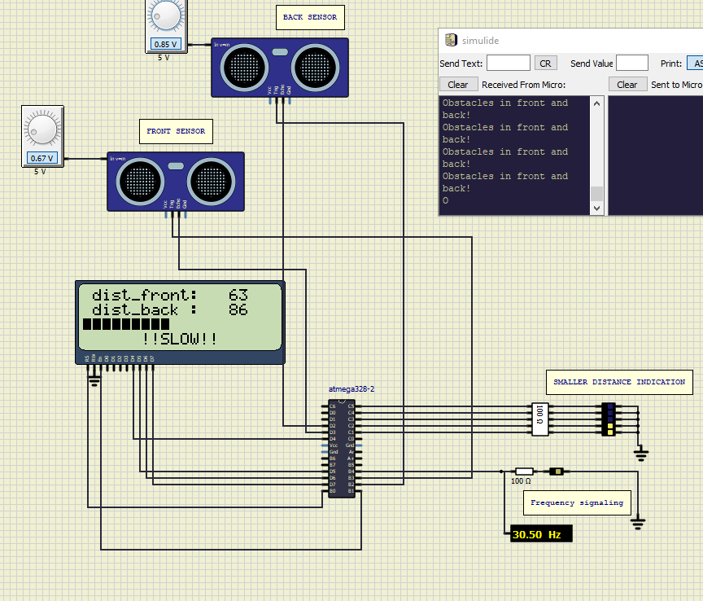
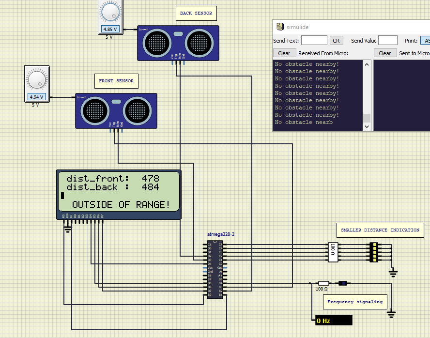

<h1> Project DE-2 </h1>
Authors:  

Alexandr Voronin, link to github repository: https://github.com/AlexandrVoronin/Digital-electronics-2/tree/master/project

Richard Šebo, link to github repository: https://github.com/richar-d/Digital-electronics-2/tree/master/project

<h3>Project objectives</h3>
	

Application of parking assistant using two HC-SR04 sensors. Output interface:LCD, frequency "audio", led stripe

<h2> Hardware description </h3>

<h3> HC-SR04 </h3>

HC-SR04 is a distance measuring sensor with range from 2cm to 4m. It has 4 pins: Vcc, Gnd, trigger, echo. To start its function it must first recieve pulse of at least 10us to the trigger pin. Sensor then transmits a sonic burst of eight pulses at 40 KHz. This pattern makes the signal unique, which allows it to differentiate between emitted signal and ambient noise. The echo pin is set to high and if the pulses are not reflected back it times out after 38ms  and is set to low (no obstacle in range). If the pulses are reflected, echo is set to low when the signal is received producing pulse with width between 150 µS to 25 mS based on how long it took the signal to come back. Based on that and knowing the speed of sound we can calculate the distance between the sensor and object that reflected the original pulses. In our program we let the MCU itterate as fast as it can as long as echo is HIGH, and then convert to distance by multiplying the result with precalculated constant

<h3> Atmega328p </h3>

Application was brought to life using Atmega328p, 8-bit microchip controller. It has 21 GPIO pins accessed through registers PORTB,PORTC,PORTD. We are using external interrupt pins (PD3,PD2) for echo signals and I/O pins (PB3,PB2) for sending trigger signal to the sensor. I/0 pins PC1-5 are used for the led stripe output. I/0 pin PB4 is used for output to led replacing audio signaling by blinking in different frequencies based on smaller distance. Freqeuncies are generated based on different overflow times for internal timer overflow. For LCD pins PD4-7 are used for data ports, pin PB0 asi RS pin and port PB1 as E pin. 

<h3> LCD </h3>
Electronic device used for displaying ASCII text. It offers various display sizes. We are using 20x4. It is capable of operating i 8-bit mode, however 4-bit mode is more appropriate for mcu since only 6-7 pins are neede compared to 11pins with 8-bit. The 6 pin interface we are using consists of:

-RS  register select. Selects the data or instruction register inside the HD44780,
	
	- RS=0, when a command is given
	- RS=1, when data is sent
	
-E  enable. Loads data into lcd on falling edge

-D7:4 Upper 4its used in 4-bit mode.

<h3>Circuit diagram</h3>

<h2> Software description </h3>

SimulIDE: Simple real time electronic circuit simulator, with acces to atmega328p

Atmel Studio: Integrated Development Environment (IDE) for developing and debugging AVR® and SAM microcontroller applications

<h2> Code description </h2>

[main.c](main.c) consists of:
1. Import of libraries
2. Global variables initialization

`volatile uint8_t sensor_id = 0;`	- Select sensor for which the main loop executes
`volatile float distances[] = {0,0};`	- distances[0] = distance to front sensor; distances [1] = distance to back sensor
`char lcd_string[50];`			- For displaying data on lcd

3. Main function body:

	a) Initial settings:
	  - Initialization of the LCD display and pins
	  - Enable and initialize Timer2 overflow
	  - Configuration of external interrupt so that, rising edge of INT1 or INT0 generates an interrupt request for either the front or the back sensor.
   
   
	b) Infinite loop while(1):
	  - If trigger_enable equals 1 (set to 1 as initial value or by ISR), ultrasonic wave is sent by one of the sensors and trigger_enable is set to 0
	  - Save the closer of the 2 distances to a local variable
	  - Update loading bar, LCD warning and UART information - loading bar and warning always represent the sensor which is closer to an obstacle
	  - Change sensor for the next loop

4. ISR(INT1_vect) and ISR(INT0_vect)
- These ISRs are used for getting the distance to an obstacle, each sensor uses its own ISR
- As long as echo signal from either sensor is 1, iterate the distance
- Set trigger_enable to 1, this allows sending another pulse in main body infinite loop

5. ISR(TIMER2_OVF_vect)
- This ISR is used for sound alarm when an obstacle is close
- In the first step, the closer of the 2 distances is chosen
- Timer overflow is changed depending on the distance, this changes the frequency of sound signalisation

[project_setup.c](project_setup.c):
- Functions used for configuration of the pins and LCD display, functions for controling LEDs (see functions table)

[project_functions.c](project_functions.c):
- Functions used for displaying and updating the distance, loading bar and warnings on LCD and UART information (see functions table)

[uart.c](uart.c):
- library for uart protocol (see functions table)

[lcd.c](lcd.c):
- library lcd display control (see functions table)

[gpio.c](gpio.c):
- gpio library for AVR-GCC (see functions table)

<h3> Flow chart</h3>

<h3> Simulation screenshots </h3>

<h3> Function documentation </h3>

| **Function name** | **Function parameters** | **Description** |
| :-: | :-: | :-: | 
|  `lcd_config` | - | Creates and stores custom character for the loading bar, initializes LCD (display strings which do not change), sets pointer at the beginning of CGRAM and sets DDRAM adress  |
| `pins_config` | - | Configures and initializes LED, alarm, echo and trigger pins |
| `LEDs_off` | - | Sets all LED pins to logic low |
| `LED_toggle` | `int number_of_LEDs` | Toggle 1 up to 5 LEDs |
| `LoadBar` | `int distance` | Displays loading bar on LCD based on the smaller distance |
| `Display_dist` | `uint8_t id`, `volatile float dist[]`, `char string[]` | Displays front and back distance on LCD | 
| `Update_warning` | `int sm_dist` | Displays warning messages on LCD |
| `Uart_info` | `volatile float dist []` | Displays warning messages via UART |

| **Function name** | **Function parameters** | **Description** |
| :-- | :-- | :-- | 
| `lcd_init` | `LCD_DISP_OFF` `LCD_DISP_ON` `LCD_DISP_ON_CURSOR` `LCD_DISP_ON_CURSOR_BLINK` | Display off&nbsp;&nbsp;&nbsp;&nbsp;&nbsp;&nbsp;&nbsp;&nbsp;&nbsp;&nbsp;&nbsp;&nbsp;&nbsp;&nbsp;&nbsp;&nbsp;&nbsp;&nbsp;&nbsp;&nbsp;&nbsp;&nbsp;&nbsp;&nbsp;&nbsp;&nbsp;&nbsp;&nbsp;&nbsp;&nbsp;&nbsp;&nbsp;&nbsp;&nbsp;&nbsp;&nbsp;&nbsp;&nbsp;&nbsp;&nbsp;&nbsp;&nbsp;&nbsp;&nbsp;&nbsp; &nbsp; &nbsp; &nbsp; |
| `lcd_clrscr` | - |Clear display and set cursor to home position. |
| `lcd_gotoxy` | `uint8_t x`   `uint8_t y`  |Set cursor to specified position. |
| `lcd_putc` | `char 	c` | Display character at current cursor position.|
| `lcd_puts` | `const char * 	s` | Display string without auto linefeed.|
| `lcd_command` | `uint8_t 	cmd` |Send LCD controller instruction command. |
| `lcd_data` | `uint8_t 	data` |Send data byte to LCD controller.Similar to lcd_putc(), but without interpreting LF |
| `uart_init` | `UART_BAUD_SELECT(9600, F_CPU)` | Initialize UART to 8N1 and set baudrate to 9600&nbsp;Bd |
| `uart_getc` | `none(void)`  |  Get received byte from ringbuffer &nbsp;Bd |
| `uart_putc` | `unsigned char data`  | Put byte to ringbuffer for transmitting via UART. |
| `uart_puts` | `const char* s` | Put string to ringbuffer for transmitting via UART. |
| `GPIO_config_output` | `volatile uint8_t *reg_name, uint8_t pin_num` | Configure one output pin in Data Direction Register |
| `GPIO_config_input_nopull` | `volatile uint8_t *reg_name, uint8_t pin_num` | Configure one input pin in DDR without pull-up resistor |
| `GPIO_config_input_pullup` | `volatile uint8_t *reg_name, uint8_t pin_num` | Configure one input pin in DDR and enable pull-up resistor |
| `GPIO_write_low` | `volatile uint8_t *reg_name, uint8_t pin_num` | Set one output pin in PORT register to low |
| `GPIO_write_high` | `volatile uint8_t *reg_name, uint8_t pin_num` | Set one output pin in PORT register to high |
| `GPIO_toggle` | `volatile uint8_t *reg_name, uint8_t pin_num` | Toggle one output pin value in PORT register |
| `GPIO_read` | `volatile uint8_t *reg_name, uint8_t pin_num` | Get input pin value from PIN register, returns `uint8_t

## References

1. https://components101.com/sites/default/files/component_datasheet/HCSR04%20Datasheet.pdf)
2. https://sites.google.com/site/qeewiki/books/avr-guide/external-interrupts-on-the-atmega328
3. https://maxpromer.github.io/LCD-Character-Creator/
4. https://www.microchip.com/wwwproducts/en/ATmega328p

